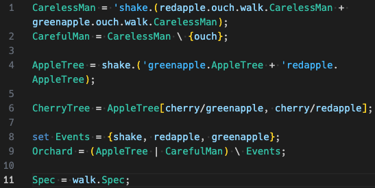

# CCS Syntax Highlighting

This extention provides syntax highlighting for [CAAL](https://caal.cs.aau.dk)-like CCS.

## Features

Currently, we highlight the following operators:
- Assignment `=`
- Parallel `|`
- Prefix `.`
- Alternatives `+`
- Hiding `\`
- Renaming `/`
- Action Set definitions `set`

Also, processes (including Nil `0`) and (dual) actions are matched.

## Known Issues

Keep in mind that this is work in progress, so there might be bugs or unexpected behavior.
